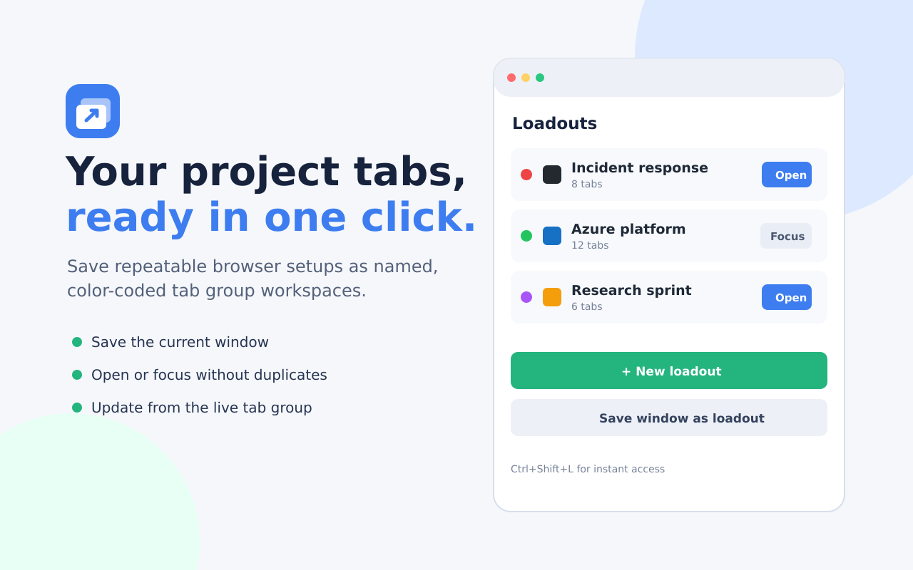

# CLabs Loadout

Chrome extension for tab-group workspaces. A loadout is a named, colored collection of URLs that opens as a single tab group with one click - and closes just as fast.

## Features

- **Loadouts as tab groups**: open a saved set of URLs as a colored, titled tab group, in a new window or the current one.
- **Save window as loadout**: snapshot every tab in the current window into a new loadout with one click.
- **Live tracking**: the popup shows which loadouts are open right now. Open focuses an already-open group instead of duplicating it, and Close only closes the group the extension opened - never a same-named group it didn't.
- **Update from open tabs**: opened a loadout, then added or closed tabs inside its group? One click writes the current group state back to the saved loadout.
- **Omnibox launcher**: type `lo` then a space in the address bar, then part of a loadout name, and hit Enter.
- **Add pages as you browse**: right-click any page or link and add it to a loadout, or start a new loadout from it.
- **Import/export**: plain-JSON backup and restore from the settings page.
- **Keyboard shortcut**: `Ctrl+Shift+L` opens the launcher popup.
- Drag to reorder, favicons and tab counts in the list, dark mode.

## Storage

Loadouts are stored in Chrome sync storage, one item per loadout, so they follow your Chrome profile and a long list can't hit the per-item quota. Live group tracking uses session storage and resets when the browser restarts.

## Permissions

- `tabGroups`, `tabs`: create, focus, and read the tab groups that loadouts open, and snapshot window tabs when you ask.
- `storage`: save your loadouts and settings.
- `contextMenus`: the right-click "Add page to loadout" menu.
- `favicon`: Chrome's built-in favicon cache for the list icons - no network requests.

The extension makes no network calls and collects nothing.

See the [privacy policy](PRIVACY.md) for the full storage and permission disclosures.

## Support development

CLabs Loadout is free, open source, and has no ads or analytics. If it saves you time, you can [buy Eugene a coffee](https://buycoffee.to/bidney).

## Install (unpacked)

1. `chrome://extensions` - enable Developer mode.
2. Load unpacked - select this folder.
